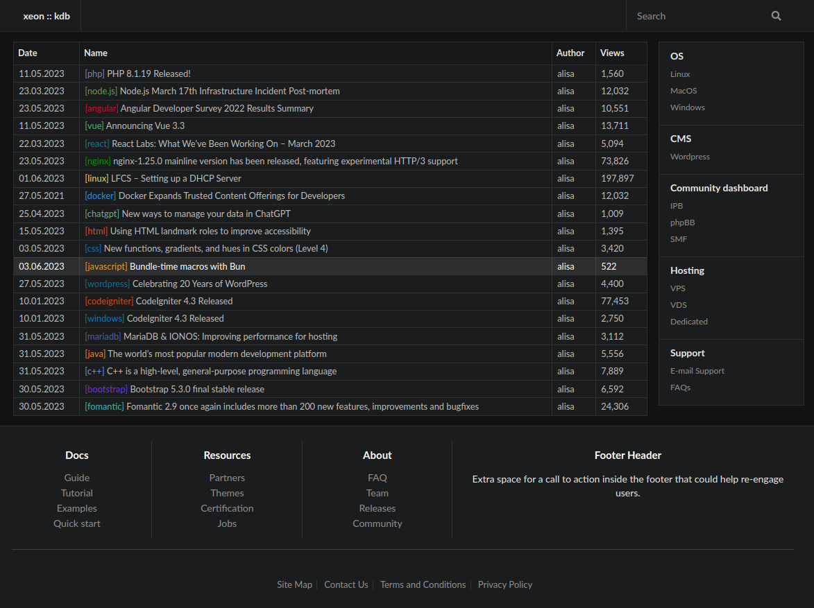

# theme-kdb
Wordpress theme: Knowledge database (kdb)  
Custom colors for categories by slug name

CMS: Wordpress (Version:	6.2.2  )  
PHP: 8.1  

Theme Name:	Knowledge database (kdb)  
Version:	1.0  
Author:	Alisa Corporation  
Author website:	https://kdb.xeon.lv  
Parent theme:	None  
Theme features	core-block-patterns, widgets-block-editor, title-tag, custom-logo, automatic-feed-links, menus  
Auto-updates:	Disabled  
